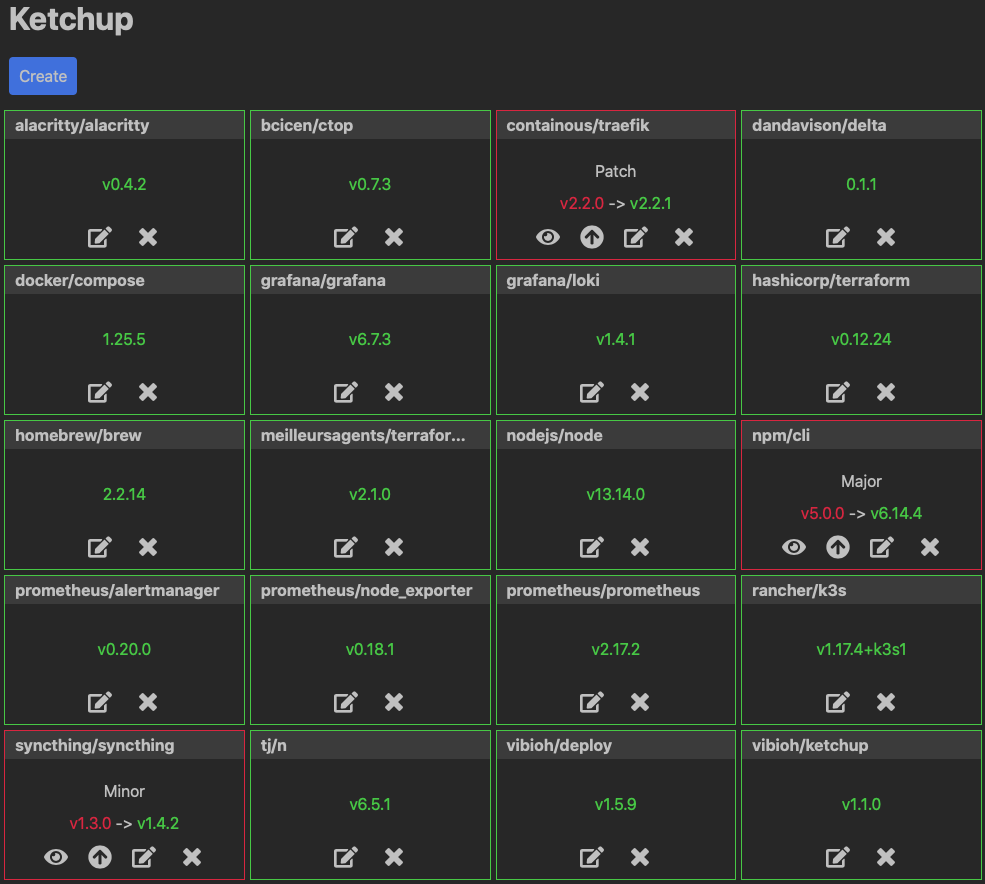

# ketchup

[](https://travis-ci.com/ViBiOh/ketchup)
[](https://codecov.io/gh/ViBiOh/ketchup)
[](https://goreportcard.com/report/github.com/ViBiOh/ketchup)
[](https://sonarcloud.io/dashboard?id=ViBiOh_ketchup)

Thanks to [OpenEmoji](https://openmoji.org) for favicon.

Thanks to [FontAwesome](https://fontawesome.com) for icons.

> Check your Github dependencies every day at 8am and send a digest by email.



## Features

- Timezone aware cron
- Simple and plain HTML interface, mobile ready
- Healthcheck available on `/health` endpoint
- Version available on `/version` endpoint
- Prometheus metrics for Golang and HTTP available on `/metrics` endpoint
- Graceful shutdown of HTTP listener
- Docker/Kubernetes ready container
- [12factor app](https://12factor.net) compliant

## Getting started

### Prerequisites

You need a [Github OAuth Token](https://github.com/settings/tokens), with no particular permission, for having a decent rate-limiting when querying Github. Configuration is done by passing `-githubToken` arg or setting equivalent environment variable (cf. [Usage](#usage) section)

You need a Postgres database for storing your datas. I personnaly use free tier of [ElephantSQL](https://www.elephantsql.com). Once setup, you _have to_ to create schema with [Auth DDL](https://github.com/ViBiOh/auth/blob/master/ddl.sql) and [Ketchup DDL](sql/ddl.sql). Configuration is done by passing `-dbHost`, `-dbName`, `-dbUser`, `-dbPass` arg or setting equivalent environment variables (cf. [Usage](#usage) section).

In order to send email, you must configure a [mailer](https://github.com/ViBiOh/mailer#getting-started). Configuration is done by passing `-mailerURL` arg or setting equivalent environment variable (cf. [Usage](#usage) section).

### Installation

Golang binary is built with static link. You can download it directly from the [Github Release page](https://github.com/ViBiOh/ketchup/releases) or build it by yourself by cloning this repo and running `make`.

A Docker image is available for `amd64`, `arm` and `arm64` platforms on Docker Hub: [vibioh/ketchup](https://hub.docker.com/r/vibioh/ketchup/tags).

You can configure app by passing CLI args or environment variables (cf. [Usage](#usage) section). CLI override environment variables.

You'll find a Kubernetes exemple (without secrets) in the [`infra/`](infra/) folder.

## Usage

```bash
Usage of ketchup:
  -address string
        [http] Listen address {KETCHUP_ADDRESS}
  -cert string
        [http] Certificate file {KETCHUP_CERT}
  -corsCredentials
        [cors] Access-Control-Allow-Credentials {KETCHUP_CORS_CREDENTIALS}
  -corsExpose string
        [cors] Access-Control-Expose-Headers {KETCHUP_CORS_EXPOSE}
  -corsHeaders string
        [cors] Access-Control-Allow-Headers {KETCHUP_CORS_HEADERS} (default "Content-Type")
  -corsMethods string
        [cors] Access-Control-Allow-Methods {KETCHUP_CORS_METHODS} (default "GET")
  -corsOrigin string
        [cors] Access-Control-Allow-Origin {KETCHUP_CORS_ORIGIN} (default "*")
  -csp string
        [owasp] Content-Security-Policy {KETCHUP_CSP} (default "default-src 'self'; base-uri 'self'")
  -dbHost string
        [db] Host {KETCHUP_DB_HOST}
  -dbName string
        [db] Name {KETCHUP_DB_NAME}
  -dbPass string
        [db] Pass {KETCHUP_DB_PASS}
  -dbPort uint
        [db] Port {KETCHUP_DB_PORT} (default 5432)
  -dbSslmode string
        [db] SSL Mode {KETCHUP_DB_SSLMODE} (default "disable")
  -dbUser string
        [db] User {KETCHUP_DB_USER}
  -frameOptions string
        [owasp] X-Frame-Options {KETCHUP_FRAME_OPTIONS} (default "deny")
  -githubToken string
        [github] OAuth Token {KETCHUP_GITHUB_TOKEN}
  -graceDuration string
        [http] Grace duration when SIGTERM received {KETCHUP_GRACE_DURATION} (default "15s")
  -hsts
        [owasp] Indicate Strict Transport Security {KETCHUP_HSTS} (default true)
  -key string
        [http] Key file {KETCHUP_KEY}
  -mailerPass string
        [mailer] Pass {KETCHUP_MAILER_PASS}
  -mailerURL string
        [mailer] URL (an instance of github.com/ViBiOh/mailer) {KETCHUP_MAILER_URL}
  -mailerUser string
        [mailer] User {KETCHUP_MAILER_USER}
  -okStatus int
        [http] Healthy HTTP Status code {KETCHUP_OK_STATUS} (default 204)
  -port uint
        [http] Listen port {KETCHUP_PORT} (default 1080)
  -prometheusPath string
        [prometheus] Path for exposing metrics {KETCHUP_PROMETHEUS_PATH} (default "/metrics")
  -schedulerHour string
        [scheduler] Hour of cron, 24-hour format {KETCHUP_SCHEDULER_HOUR} (default "08:00")
  -schedulerLoginID uint
        [scheduler] Scheduler user ID {KETCHUP_SCHEDULER_LOGIN_ID} (default 1)
  -schedulerTimezone string
        [scheduler] Timezone {KETCHUP_SCHEDULER_TIMEZONE} (default "Europe/Paris")
  -uiPublicPath string
        [ui] Public path {KETCHUP_UI_PUBLIC_PATH} (default "ketchup.vibioh.fr")
  -url string
        [alcotest] URL to check {KETCHUP_URL}
  -userAgent string
        [alcotest] User-Agent for check {KETCHUP_USER_AGENT} (default "Alcotest")
```

## Contributing

Thanks for your interest in contributing! There are many ways to contribute to this project. [Get started here](CONTRIBUTING.md).

## CI

Following variables are required for CI:

|            Name            |           Purpose           |
| :------------------------: | :-------------------------: |
|      **DOCKER_USER**       | for publishing Docker image |
|      **DOCKER_PASS**       | for publishing Docker image |
| **SCRIPTS_NO_INTERACTIVE** | for disabling prompt in CI  |
